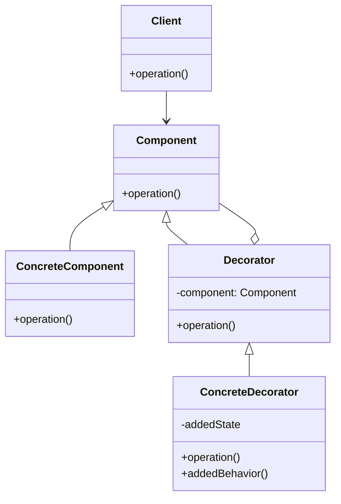

# Design Pattern Information Page Guidelines

## Overview

This document provides guidelines for creating comprehensive and educational design pattern information pages for the Algorithm & Pattern Visualizer application. Each design pattern page should follow a consistent structure to ensure users can easily understand and learn from the content.

## Page Structure

### 1. Header Section

```tsx
<h1 className="text-3xl font-bold mb-4">{Pattern Name}</h1>
<div className="bg-indigo-50 p-4 rounded-lg mb-6 border border-indigo-200">
  <p className="text-lg text-indigo-700">
    {One-sentence definition of the pattern}
  </p>
</div>
```

### 2. Introduction

- **Definition**: Clear, concise explanation of what the pattern is
- **Classification**: Which category it belongs to (Creational, Structural, Behavioral)
- **Intent**: What problem the pattern solves
- **Also Known As**: Alternative names (if applicable)

### 3. Problem Statement

Describe a real-world scenario where this pattern would be useful. Use concrete examples that developers can relate to.

### 4. Structure

Include a diagram showing the relationships between classes/components in the pattern. Use the `create_diagram` tool with Mermaid syntax for consistency.

Example Mermaid diagram:



### 5. Participants

List and describe the key classes/interfaces involved in the pattern:

- **Class/Interface Name**: Responsibility and role in the pattern
- **Relationships**: How it interacts with other components

### 6. Implementation

Provide code examples in multiple languages (at least JavaScript/TypeScript and one other language). Use the code-language-switcher component to allow users to toggle between languages.

Example TypeScript implementation:

```typescript
// Abstract Component
interface Coffee {
  cost(): number;
  description(): string;
}

// Concrete Component
class SimpleCoffee implements Coffee {
  cost(): number {
    return 10;
  }
  
  description(): string {
    return "Simple coffee";
  }
}

// Abstract Decorator
abstract class CoffeeDecorator implements Coffee {
  protected decoratedCoffee: Coffee;
  
  constructor(coffee: Coffee) {
    this.decoratedCoffee = coffee;
  }
  
  cost(): number {
    return this.decoratedCoffee.cost();
  }
  
  description(): string {
    return this.decoratedCoffee.description();
  }
}

// Concrete Decorators
class MilkDecorator extends CoffeeDecorator {
  cost(): number {
    return this.decoratedCoffee.cost() + 2;
  }
  
  description(): string {
    return this.decoratedCoffee.description() + ", with milk";
  }
}

class SugarDecorator extends CoffeeDecorator {
  cost(): number {
    return this.decoratedCoffee.cost() + 1;
  }
  
  description(): string {
    return this.decoratedCoffee.description() + ", with sugar";
  }
}

// Usage
const myCoffee = new SimpleCoffee();
console.log(`${myCoffee.description()}: $${myCoffee.cost()}`);

const milkCoffee = new MilkDecorator(myCoffee);
console.log(`${milkCoffee.description()}: $${milkCoffee.cost()}`);

const sweetMilkCoffee = new SugarDecorator(milkCoffee);
console.log(`${sweetMilkCoffee.description()}: $${sweetMilkCoffee.cost()}`);
```

### 7. Interactive Example

If possible, include an interactive visualization that demonstrates how the pattern works. This could be:

- A step-by-step walkthrough
- An animated diagram
- A small interactive demo

### 8. Consequences

Discuss the benefits and tradeoffs of using this pattern:

- **Benefits**: What advantages does this pattern provide?
- **Tradeoffs**: What are the potential downsides or complexities?
- **Performance Implications**: Any notable performance considerations

### 9. Related Patterns

List and briefly describe other patterns that:
- Are commonly used with this pattern
- Solve similar problems
- Might be alternatives to this pattern

### 10. Real-World Examples

Provide 2-3 examples of where this pattern is used in popular frameworks, libraries, or applications.

## UI Guidelines Based on Project Style

To maintain consistency with the existing project style (as seen in Array.tsx), follow these UI guidelines:

### Page Layout

```tsx
import { useState } from 'react';
import { motion, AnimatePresence } from 'framer-motion';
import { CodeLanguageSwitcherV2 } from '../../components/code-language-switcher-v2';
import { patternNameSnippets } from '../../CodeSnippets/designPatterns/patternNameSnippets';

const PatternName = () => {
  const [activeTab, setActiveTab] = useState<'implementation' | 'examples'>('implementation');

  return (
    <div className="flex flex-col items-center justify-center mb-8">
      <h2 className="text-4xl font-semibold text-indigo-700 mb-4">{Pattern Name} Pattern</h2>
      
      {/* Overview Card */}
      <div className="bg-white p-6 rounded-lg shadow-md max-w-5xl">
        <div className="mb-4 p-4 bg-indigo-50 rounded-lg border border-indigo-200">
          <h3 className="text-lg font-semibold text-indigo-700 mb-2">{Pattern Name} Overview</h3>
          <p className="text-sm font-medium text-indigo-600 mb-2">
            {One-sentence definition of the pattern}
          </p>
          <ul className="list-none font-medium space-y-1 text-sm text-indigo-600">
            <li>• {Key Feature 1}: {Brief explanation}</li>
            <li>• {Key Feature 2}: {Brief explanation}</li>
            <li>• {Key Feature 3}: {Brief explanation}</li>
          </ul>
          <p className="text-sm font-medium text-indigo-600 mt-4">
            {Additional context or example with inline code} <code className="bg-indigo-100 px-1 rounded">{code snippet}</code>
          </p>
        </div>
        
        {/* Visual representation of the pattern */}
        <div className="flex items-center justify-center">
          {/* Pattern-specific visualization goes here */}
        </div>
      </div>

      {/* Characteristics Table */}
      <div className="mt-8 bg-white p-6 rounded-lg shadow-md w-full max-w-4xl">
        <h2 className="text-xl font-semibold text-indigo-700 mb-4">{Pattern Name} Characteristics</h2>
        <table className="w-full border-collapse">
          <thead>
            <tr className="bg-indigo-100">
              <th className="border border-indigo-200 p-2 text-left">Aspect</th>
              <th className="border border-indigo-200 p-2 text-left">Details</th>
              <th className="border border-indigo-200 p-2 text-left">Notes</th>
            </tr>
          </thead>
          <tbody>
            <tr>
              <td className="border border-indigo-200 p-2">Type</td>
              <td className="border border-indigo-200 p-2">{Creational/Structural/Behavioral}</td>
              <td className="border border-indigo-200 p-2">{Additional context}</td>
            </tr>
            <tr>
              <td className="border border-indigo-200 p-2">Complexity</td>
              <td className="border border-indigo-200 p-2">{Low/Medium/High}</td>
              <td className="border border-indigo-200 p-2">{Explanation of complexity}</td>
            </tr>
            <tr>
              <td className="border border-indigo-200 p-2">Usage Frequency</td>
              <td className="border border-indigo-200 p-2">{Common/Occasional/Rare}</td>
              <td className="border border-indigo-200 p-2">{Where it's commonly used}</td>
            </tr>
            <tr>
              <td className="border border-indigo-200 p-2">Key Benefit</td>
              <td className="border border-indigo-200 p-2">{Primary advantage}</td>
              <td className="border border-indigo-200 p-2">{Why this matters}</td>
            </tr>
            <tr>
              <td className="border border-indigo-200 p-2">Key Tradeoff</td>
              <td className="border border-indigo-200 p-2">{Primary disadvantage}</td>
              <td className="border border-indigo-200 p-2">{How to mitigate}</td>
            </tr>
          </tbody>
        </table>
      </div>

      {/* Tab Navigation */}
      <div className="border-t border-gray-300 my-8"></div>

      <div className='flex justify-center mb-8'>
        <button
          className={`px-32 py-3 mr-4 rounded-lg transition-all duration-300 ${
            activeTab === 'implementation' 
              ? 'bg-indigo-600 text-white shadow-lg' 
              : 'bg-white text-indigo-600 hover:bg-indigo-100'
          }`}
          onClick={() => setActiveTab('implementation')}
        >
          Implementation
        </button>
        <button
          className={`px-32 py-3 mr-4 rounded-lg transition-all duration-300 ${
            activeTab === 'examples' 
              ? 'bg-indigo-600 text-white shadow-lg' 
              : 'bg-white text-indigo-600 hover:bg-indigo-100'
          }`}
          onClick={() => setActiveTab('examples')}
        >
          Examples
        </button>
      </div>

      {/* Tab Content with Animation */}
      <AnimatePresence mode="wait">
        <motion.div
          key={activeTab}
          initial={{ opacity: 0, y: 20 }}
          animate={{ opacity: 1, y: 0 }}
          exit={{ opacity: 0, y: -20 }}
          transition={{ duration: 0.3 }}
          className="w-full"
        >
          {activeTab === 'implementation' ? (
            <div className="bg-white p-6 rounded-lg shadow-md max-w-5xl mx-auto">
              <h3 className="text-xl font-semibold text-indigo-700 mb-4">Implementation</h3>
              <CodeLanguageSwitcherV2 codeSnippets={patternNameSnippets} />
              
              <div className="mt-8">
                <h4 className="text-lg font-semibold text-indigo-700 mb-2">Implementation Notes</h4>
                <p className="text-gray-700">
                  {Detailed explanation of the implementation}
                </p>
              </div>
            </div>
          ) : (
            <div className="bg-white p-6 rounded-lg shadow-md max-w-5xl mx-auto">
              <h3 className="text-xl font-semibold text-indigo-700 mb-4">Real-World Examples</h3>
              
              <div className="mb-6">
                <h4 className="text-lg font-semibold text-indigo-600 mb-2">Example 1: {Example Name}</h4>
                <p className="text-gray-700 mb-4">{Detailed description of the example}</p>
                <div className="bg-gray-50 p-4 rounded border border-gray-200">
                  {/* Visual representation or code snippet */}
                </div>
              </div>
              
              <div className="mb-6">
                <h4 className="text-lg font-semibold text-indigo-600 mb-2">Example 2: {Example Name}</h4>
                <p className="text-gray-700 mb-4">{Detailed description of the example}</p>
                <div className="bg-gray-50 p-4 rounded border border-gray-200">
                  {/* Visual representation or code snippet */}
                </div>
              </div>
            </div>
          )}
        </motion.div>
      </AnimatePresence>
    </div>
  );
};

export default PatternName;
```

### Design Elements

1. **Color Scheme**
   - Primary: Indigo (`text-indigo-700`, `bg-indigo-600`)
   - Secondary: White/Gray for backgrounds (`bg-white`, `bg-gray-50`)
   - Highlights: Light indigo for info boxes (`bg-indigo-50`, `border-indigo-200`)

2. **Typography**
   - Headings: Large, semibold, indigo (`text-4xl font-semibold text-indigo-700`)
   - Body text: Regular weight, dark gray (`text-gray-700`)
   - Feature lists: Medium weight, small text, indigo (`font-medium text-sm text-indigo-600`)

3. **Layout Components**
   - Cards with shadow and rounded corners (`bg-white rounded-lg shadow-md`)
   - Information boxes with light backgrounds (`bg-indigo-50 rounded-lg border border-indigo-200`)
   - Tables with bordered cells (`border-collapse`, `border border-indigo-200`)
   - Tabs with active/inactive states

4. **Interactive Elements**
   - Buttons with hover effects and active states
   - Animated transitions between tabs
   - Code language switcher for multiple implementations

5. **Visual Hierarchy**
   - Main heading at top
   - Overview card with key information
   - Characteristics table for quick reference
   - Tab navigation for detailed content
   - Consistent spacing between sections (`mb-4`, `mb-8`, etc.)

### Animation Guidelines

Use Framer Motion for smooth transitions:

```tsx
<AnimatePresence mode="wait">
  <motion.div
    key={activeTab}
    initial={{ opacity: 0, y: 20 }}
    animate={{ opacity: 1, y: 0 }}
    exit={{ opacity: 0, y: -20 }}
    transition={{ duration: 0.3 }}
  >
    {/* Tab content */}
  </motion.div>
</AnimatePresence>
```

## Styling Guidelines

Use consistent styling throughout the page:

- **Headers**: Use appropriate heading levels (h1, h2, h3)
- **Code Blocks**: Always use syntax highlighting
- **Colors**: Use the application's color scheme (indigo primary color)
- **Diagrams**: Use a consistent style for all diagrams
- **Spacing**: Maintain consistent spacing between sections

## Example Page Template

```tsx
import { CodeLanguageSwitcherV2 } from '../../components/code-language-switcher-v2';
import { patternNameSnippets } from '../../CodeSnippets/designPatterns/patternNameSnippets';

const PatternName = () => {
  return (
    <div className="max-w-4xl mx-auto p-8 bg-white rounded shadow">
      {/* Header */}
      <h1 className="text-3xl font-bold mb-4">Pattern Name</h1>
      <div className="bg-indigo-50 p-4 rounded-lg mb-6 border border-indigo-200">
        <p className="text-lg text-indigo-700">
          One-sentence definition of the pattern
        </p>
      </div>
      
      {/* Introduction */}
      <section className="mb-8">
        <h2 className="text-2xl font-semibold mb-3 text-indigo-700">Introduction</h2>
        <p className="mb-4">Detailed explanation of the pattern...</p>
        <p><strong>Classification:</strong> Category</p>
        <p><strong>Intent:</strong> What problem it solves</p>
      </section>
      
      {/* Problem Statement */}
      <section className="mb-8">
        <h2 className="text-2xl font-semibold mb-3 text-indigo-700">Problem Statement</h2>
        <p>Description of the problem this pattern addresses...</p>
      </section>
      
      {/* Structure */}
      <section className="mb-8">
        <h2 className="text-2xl font-semibold mb-3 text-indigo-700">Structure</h2>
        <div className="border border-gray-200 rounded-lg p-4 bg-gray-50 mb-4">
          {/* Diagram would go here */}
        </div>
      </section>
      
      {/* Implementation */}
      <section className="mb-8">
        <h2 className="text-2xl font-semibold mb-3 text-indigo-700">Implementation</h2>
        <CodeLanguageSwitcherV2 codeSnippets={patternNameSnippets} />
      </section>
      
      {/* Consequences */}
      <section className="mb-8">
        <h2 className="text-2xl font-semibold mb-3 text-indigo-700">Consequences</h2>
        <h3 className="text-xl font-medium mb-2 text-indigo-600">Benefits</h3>
        <ul className="list-disc pl-5 mb-4">
          <li>Benefit 1</li>
          <li>Benefit 2</li>
        </ul>
        
        <h3 className="text-xl font-medium mb-2 text-indigo-600">Tradeoffs</h3>
        <ul className="list-disc pl-5">
          <li>Tradeoff 1</li>
          <li>Tradeoff 2</li>
        </ul>
      </section>
      
      {/* Related Patterns */}
      <section className="mb-8">
        <h2 className="text-2xl font-semibold mb-3 text-indigo-700">Related Patterns</h2>
        <ul className="list-disc pl-5">
          <li><strong>Pattern 1:</strong> Brief description of relationship</li>
          <li><strong>Pattern 2:</strong> Brief description of relationship</li>
        </ul>
      </section>
    </div>
  );
};

export default PatternName;
```

## Code Snippet Structure

For each design pattern, create a file in the `CodeSnippets/designPatterns/` directory with implementations in multiple languages:

```typescript
export const patternNameSnippets = {
  typescript: `// TypeScript implementation...`,
  javascript: `// JavaScript implementation...`,
  python: `# Python implementation...`,
  java: `// Java implementation...`,
  csharp: `// C# implementation...`
};
```

## Images and Diagrams

- Store pattern-specific images in `public/images/designPatterns/`
- Use SVG format when possible for better scaling
- Include both light and dark mode versions if applicable
- Ensure all diagrams have clear labels and arrows

## Accessibility Considerations

- Provide alt text for all images
- Ensure sufficient color contrast for text
- Use semantic HTML elements
- Test with screen readers

## References

When creating content, reference authoritative sources:
- "Design Patterns: Elements of Reusable Object-Oriented Software" by the Gang of Four
- "Head First Design Patterns" by Freeman et al.
- Official documentation of programming languages and frameworks
